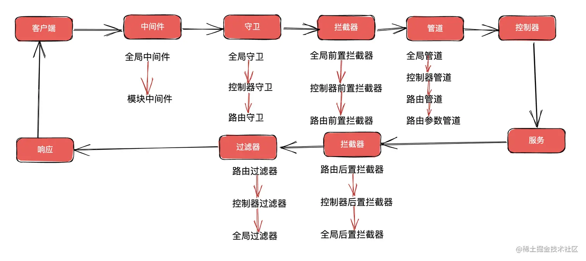
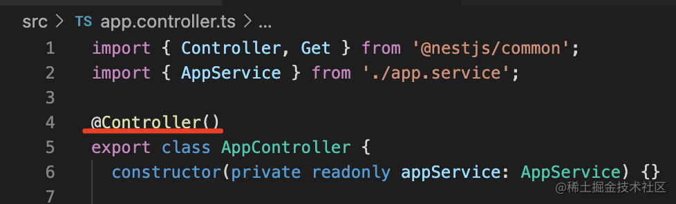
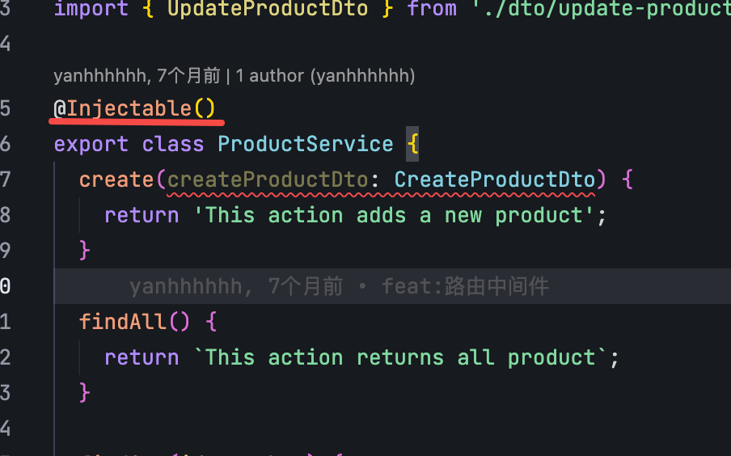
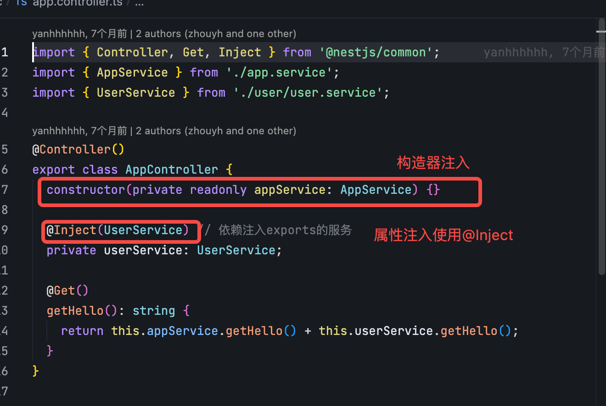
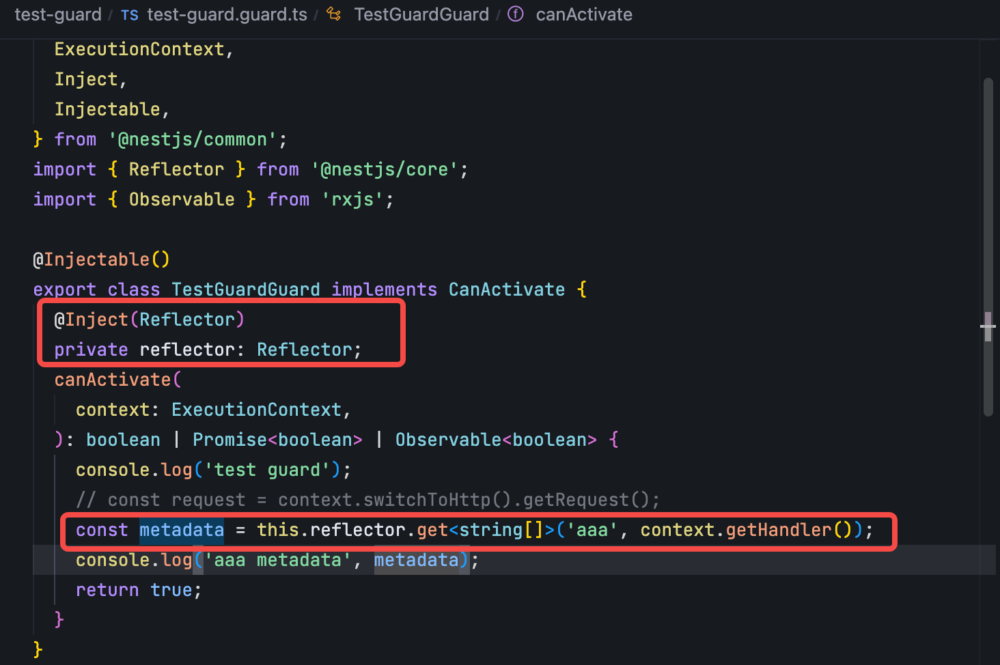
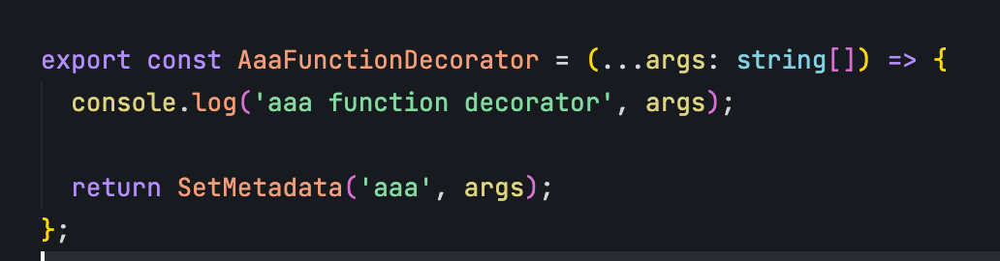
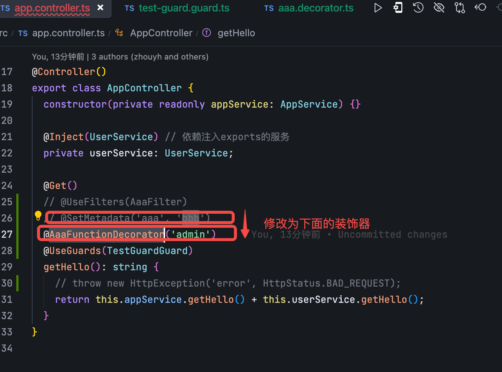
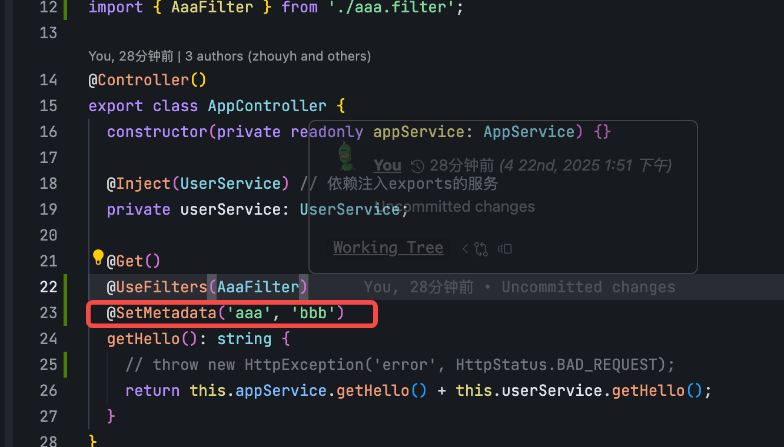
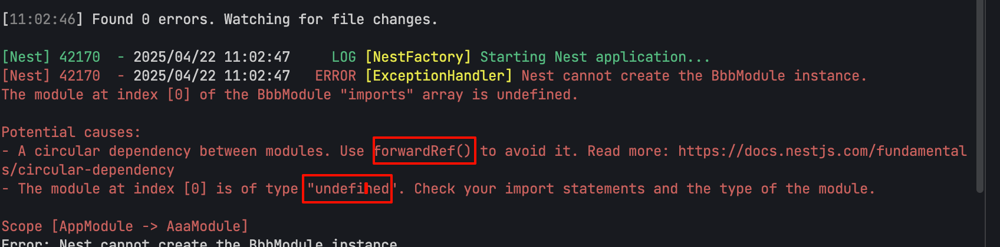

# NestJS

> 记录学习nestjs

## Installation

```bash
$ pnpm install
```

## Running the app

```bash
# development
$ pnpm run start

# watch mode
$ pnpm run start:dev

# production mode
$ pnpm run start:prod
```

## Test

```bash
# unit tests
$ pnpm run test

# e2e tests
$ pnpm run test:e2e

# test coverage
$ pnpm run test:cov
```

## 生命周期



## Doc

### ART-Pi RT-Thread (Embedded)

- [ART-Pi I2C & VL53L1X-v2 Guide](./notes/ART-Pi-RTThread/README.md) - Complete guide for using ART-Pi with I2C and VL53L1X-v2 ToF sensor
- [I2C Quick Reference](./notes/ART-Pi-RTThread/i2c-quick-reference.md) - Quick reference for I2C configuration
- [VL53L1X Example Code](./notes/ART-Pi-RTThread/vl53l1x-example.md) - Detailed driver implementation
- [Example Project](./examples/art-pi-vl53l1x/) - Complete working example

### 中间件

- [doc](https://docs.nestjs.com/middleware)
- [note](./notes/中间件/index.md)
- [Middleware](./src/middleware)
- [LoggerMiddleware](./src/middleware/logger.middleware.ts)

### 装饰器

#### @Module

#### @Controller

声明controller



#### @Injectable

声明provider：

- 这个provider 可以是任何的class
- 注入方式：

  - 构造器注入
  - 属性注入

    

#### Nest 全部的装饰器

- @Module： 声明 Nest 模块
- @Controller：声明模块里的 controller
- @Injectable：声明模块里可以注入的 provider
- @Inject：通过 token 手动指定注入的 provider，token 可以是 class 或者 string
- @Optional：声明注入的 provider 是可选的，可以为空
- @Global：声明全局模块
- @Catch：声明 exception filter 处理的 exception 类型
- @UseFilters：路由级别使用 exception filter
- @UsePipes：路由级别使用 pipe
- @UseInterceptors：路由级别使用 interceptor
- @SetMetadata：在 class 或者 handler 上添加 metadata
- @Get、@Post、@Put、@Delete、@Patch、@Options、@Head：声明 get、post、put、delete、patch、options、head 的请求方式
- @Param：取出 url 中的参数，比如 /aaa/:id 中的 id
- @Query: 取出 query 部分的参数，比如 /aaa?name=xx 中的 name
- @Body：取出请求 body，通过 dto class 来接收
- @Headers：取出某个或全部请求头
- @Session：取出 session 对象，需要启用 express-session 中间件
- @HostParm： 取出 host 里的参数
- @Req、@Request：注入 request 对象
- @Res、@Response：注入 response 对象，一旦注入了这个 Nest 就不会把返回值作为响应了，除非指定 passthrough 为true
- @Next：注入调用下一个 handler 的 next 方法
- @HttpCode： 修改响应的状态码
- @Header：修改响应头
- @Redirect：指定重定向的 url
- @Render：指定渲染用的模版引擎

#### 自定义装饰器

##### 方法装饰器

在guard 中使用reflector 来去metadata







##### 属性装饰器

##### 类装饰器

#### 组合装饰器

> 使用 `applyDecorators` 可以组合多个装饰器



## Question

### Module 和Provider 的循环依赖怎么处理？



    Module 之间可以相互imports，Provider 之间可以相互注入，会形成循环依赖，解决方案是**使用forwardRed** 包裹

原理： nest 会先创建 Module、Provider，之后再把引用转发到对方，也就是 forward ref
