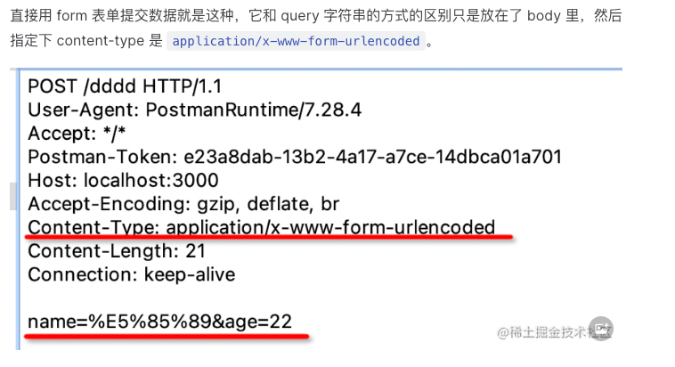
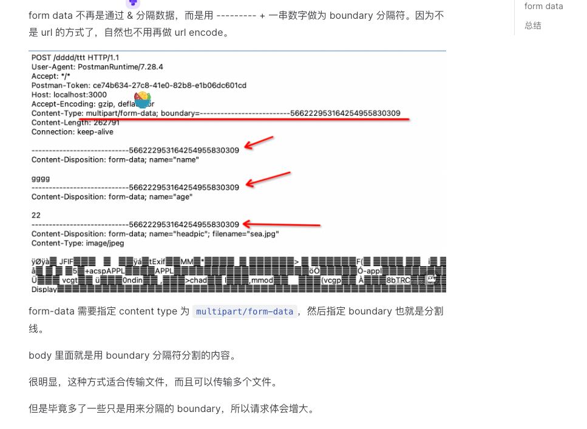

# HTTP数据传输方式

## url param

- 通过url传递参数，参数之间用/分隔
- 例如：http://www.baidu.com/jack/18
- 优点：简单，易于使用
- 缺点：传输的数据量有限，不安全，参数值有特殊字符时需要进行编码
- 适用场景：传输简单的数据，如搜索关键字等
- 传输方式：GET
- 传输数据量：有限
- 安全性：低

## query

- 通过url传递参数，参数之间用&分隔，参数名和参数值之间用=分隔
- 例如：http://www.baidu.com?name=jack&age=18
- 优点：简单，易于使用
- 缺点：传输的数据量有限，不安全，参数值有特殊字符时需要进行编码
- 适用场景：传输简单的数据，如搜索关键字等
- 传输方式：GET
- 传输数据量：有限
- 安全性：低

## form-urlencoded

- 通过表单提交数据，参数之间用&分隔，参数名和参数值之间用=分隔
- 例如：name=jack&age=18
- 优点：传输的数据量有限，安全性较高
- 缺点：参数值有特殊字符时需要进行编码
- 适用场景：传输简单的数据，如搜索关键字等
- 传输方式：POST
- 传输数据量：有限
- 安全性：中

## form-data

