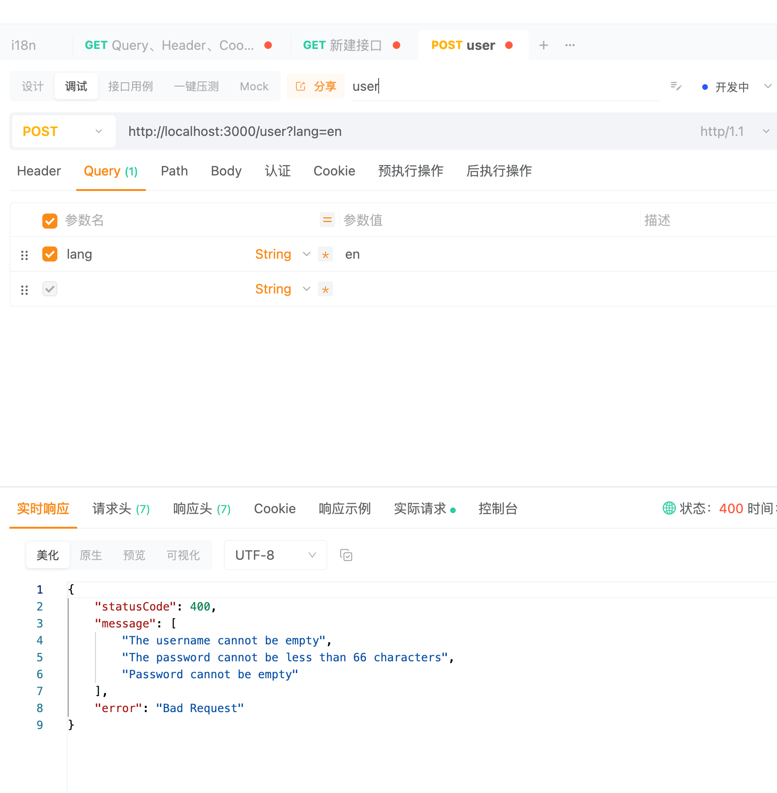

# nestjs-i18n

> NestJS 国际化支持

## 安装

```bash
npm install --save nestjs-i18n
```

## 使用

### 配置 i18n 模块

- 在 AppModule 中导入并配置 I18nModule

```ts
import { Module } from '@nestjs/common';
import { AppController } from './app.controller';
import { AppService } from './app.service';
import {
  AcceptLanguageResolver,
  CookieResolver,
  HeaderResolver,
  I18nModule,
  QueryResolver,
} from 'nestjs-i18n';
import { UserModule } from './user/user.module';
import * as path from 'path';

@Module({
  imports: [
    // 配置 I18n 模块,forRoot 方法接受一个配置对象
    I18nModule.forRoot({
      fallbackLanguage: 'en', // 默认语言
      loaderOptions: {
        path: path.join(__dirname, '/i18n/'), // 语言文件路径
        watch: true,
      },
      resolvers: [
        new QueryResolver(['lang', 'l']), // URL 查询参数解析器
        new HeaderResolver(['x-custom-lang']), // Header 解析器
        new CookieResolver(['lang']), // Cookie 解析器
        AcceptLanguageResolver, // Accept-Language 解析器
      ],
    }),
  ],
  controllers: [AppController],
  providers: [AppService],
})
export class AppModule {}
```

- 在src/i18n/目录下创建语言文件，例如 en/test.json 和 zh/test.json

  - en/test.json

  ```json
  {
    "hello": "Hello World!"
  }
  ```

  - zh/test.json

  ```json
  {
    "hello": "你好，世界！"
  }
  ```

- ** nest-cli.json 中添加 i18n 目录到编译选项 **

```json
{
  "compilerOptions": {
    "assets": ["**/*.json"],
    "watchAssets": true
  }
}
```

### 使用 i18n 服务,修改AppService

- 在 AppService 中注入 I18nService 进行国际化文本的获取

```ts
import { Inject, Injectable } from '@nestjs/common';
import { I18nContext, I18nService } from 'nestjs-i18n';

@Injectable()
export class AppService {
  @Inject()
  i18n: I18nService;

  getHello(): string {
    return this.i18n.t('test.hello', {
      lang: I18nContext.current().lang,
    });
  }
}
```

- 在 AppService 中使用@I18n 装饰器进行国际化文本的获取

```ts
import { Inject, Injectable } from '@nestjs/common';
import { I18n, I18nContext, I18nService } from 'nestjs-i18n';
@Injectable()
export class AppService {
  getHello(@I18n() i18n: I18nContext): string {
    return i18n.t('test.hello', {});
  }
}
```

### User DTO 国际化，不在Ioc容器中的类 ，如何翻译呢

- 使用Pipe
- nest g resource user
- 安装dto 验证包 npm install --save class-validator class-transformer
- CreateUserDto

```ts
import { IsNotEmpty, MinLength } from 'class-validator';

export class CreateUserDto {
  @IsNotEmpty({
    message: '用户名不能为空',
  })
  username: string;

  @IsNotEmpty({
    message: '密码不能为空',
  })
  @MinLength(6, {
    message: '密码不能少于 6 位',
  })
  password: string;
}
```

- 添加 i18n/zh/validate.json 和 i18n/en/validate.json 文件

```json
{
  "usernameNotEmpty": "用户名不能为空",
  "passwordNotEmpty": "密码不能为空",
  "passwordNotLessThan6": "密码不能少于 {num} 位"
}
```

```json
{
  "usernameNotEmpty": "Username should not be empty",
  "passwordNotEmpty": "Password should not be empty",
  "passwordNotLessThan6": "Password should not be less than {num} characters"
}
```

- 在main.ts中使用ValidationPipe

```ts
import { NestFactory } from '@nestjs/core';
import { AppModule } from './app.module';

import { I18nValidationExceptionFilter, I18nValidationPipe } from 'nestjs-i18n';

async function bootstrap() {
  const app = await NestFactory.create(AppModule);
  app.useGlobalPipes(new I18nValidationPipe());
  app.useGlobalFilters(
    new I18nValidationExceptionFilter({
      detailedErrors: false,
    }),
  );
  await app.listen(3000);
}
bootstrap();
```

- 将CreateUserDto meaasge改为key

```ts
import { IsNotEmpty, MinLength } from 'class-validator';
import { i18nValidationMessage } from 'nestjs-i18n';

export class CreateUserDto {
  @IsNotEmpty({
    message: 'validate.usernameNotEmpty',
  })
  username: string;
  @IsNotEmpty({
    message: 'validate.passwordNotEmpty',
  })
  @MinLength(6, {
    message: i18nValidationMessage('validate.passwordNotLessThan6', {
      num: 66,
    }), // 使用i18nValidationMessage 方法传递参数
  })
  password: string;
}
```

- 访问http://localhost:3000/users 创建用户时触发验证，返回国际化的错误信息


