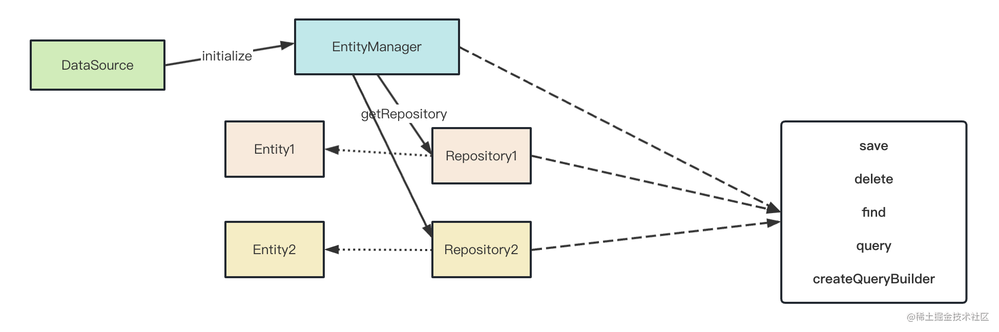

# typeORM



## 初始化方法

```typescript
import { DataSource } from 'typeorm';
export const AppDataSource = new DataSource({
  type: 'mysql',
  host: 'localhost',
  port: 3306,
  username: 'root',
  password: 'root',
  database: 'test',
  synchronize: true,
  logging: true,
  entities: [__dirname + '/entity/*.ts'],
  migrations: [],
  subscribers: [],
});
AppDataSource.initialize()
  .then(() => {
    console.log('Data Source has been initialized!');
  })
  .catch((err) => {
    console.error('Error during Data Source initialization:', err);
  });
```

## 常用方法

- save：保存一个实体，如果实体已经存在则更新它，否则插入一个新实体。
  - 当传入**主键**时，执行更新操作；否则执行插入操作。
- find：查找符合条件的实体，返回一个数组。
- findOne：查找符合条件的单个实体，返回一个实体对象或 null。
- update：更新符合条件的实体，返回更新结果。
- delete：删除符合条件的实体，返回删除结果。
- remove：删除一个实体，返回删除的实体对象。
- createQueryBuilder：创建一个查询构建器，用于构建复杂的 SQL 查询。
- 例如，使用 createQueryBuilder 查找年龄大于 18 岁的用户：

  ```typescript
  const users = await AppDataSource.getRepository(User)
    .createQueryBuilder('user')
    .where('user.age > :age', { age: 18 })
    .getMany();
  ```

- insert：插入一个新实体，返回插入结果。
- upsert：插入或更新一个实体，具体行为取决于实体是否已经存在。
- count：计算符合条件的实体数量，返回一个数字。
- findAndCount：查找符合条件的实体，并返回实体数组和数量。
- getRepository：获取实体的仓库对象，用于执行各种数据库操作。
- manager：获取实体管理器对象，用于执行各种数据库操作。
- transaction：执行一个事务操作，确保一组数据库操作要么全部成功，要么全部失败。

  ```typescript
  await AppDataSource.manager.transaction(
    async (transactionalEntityManager) => {
      // 在这里执行一组数据库操作
    },
  );
  ```

- queryRunner：获取查询运行器对象，用于执行原始 SQL 查询和事务操作。
- migration：执行数据库迁移操作，用于管理数据库结构的变更。

## TypeORM 关系映射示例

### 一对一关系

#### 装饰器：@OneToOne、@JoinColumn

- User 和 IdCard 实体之间的一对一关系

- IdCard 实体包含一个 User 实体的引用，并通过 @JoinColumn 装饰器指定外键列

  ```ts
  import {
    Column,
    Entity,
    JoinColumn,
    OneToOne,
    PrimaryGeneratedColumn,
  } from 'typeorm';
  import { User } from './User';

  @Entity()
  export class IdCard {
    @PrimaryGeneratedColumn()
    id: number;
    @Column({
      length: 50,
      comment: '身份证号码',
    })
    cardNumber: string;

    @JoinColumn()
    @OneToOne(() => User, {
      cascade: true, // 启用级联操作，允许在保存身份证时自动保存关联的用户实体
      onDelete: 'CASCADE', // 当用户被删除时，级联删除对应的身份证
      onUpdate: 'CASCADE', // 当用户的主键被更新时，级联更新对应的身份证
    })
    user: User;
  }
  ```

- User 实体包含一个 IdCard 实体的引用

  ```ts
  import { IdCard } from './IdCard';
  import {
    Entity,
    PrimaryGeneratedColumn,
    Column,
    JoinColumn,
    OneToOne,
  } from 'typeorm';

  @Entity()
  export class User {
    @PrimaryGeneratedColumn()
    id: number;

    @Column()
    firstName: string;

    @Column()
    lastName: string;

    @Column()
    age: number;

    @OneToOne(() => IdCard, (idCard) => idCard.user)
    idCard: IdCard;
  }
  ```

- IdCard @OneToOne 参数设置 cascade: true，表示在保存 User 实体时，同时保存关联的 IdCard 实体
- 使用 AppDataSource.getRepository(IdCard).save(IdCard) 方法保存 IdCard 实体时，会自动保存关联的 User 实体
- 使用 AppDataSource.getRepository(User).findOne 方法查询 User 实体时，可以通过 relations 参数加载关联的 IdCard 实体

  ```ts
  const u = await AppDataSource.manager.find(User, {
    relations: {
      idCard: true,
    },
  });
  ```

### 一对多关系

#### 装饰器：@OneToMany、@ManyToOne、@JoinColumn

- Post 和 Comment 实体之间的一对多关系

- Comment 实体包含一个 Post 实体的引用，并通过 @ManyToOne 装饰器指定外键列

  ```ts
  import { Column, Entity, ManyToOne, PrimaryGeneratedColumn } from 'typeorm';
  import { Post } from './Post';

  @Entity()
  export class Comment {
    @PrimaryGeneratedColumn()
    id: number;

    @Column({
      length: 500,
      comment: '评论内容',
    })
    content: string;

    @ManyToOne(() => Post, (post) => post.comments, {
      cascade: true, // 启用级联操作，允许在保存评论时自动保存关联的帖子实体
      onDelete: 'CASCADE', // 当帖子被删除时，级联删除对应的评论
      onUpdate: 'CASCADE', // 当帖子的主键被更新时，级联更新对应的评论
    })
    post: Post;
  }
  ```

- Post 实体包含多个 Comment 实体的引用

  ```ts
  import { Comment } from './Comment';
  import { Entity, PrimaryGeneratedColumn, Column, OneToMany } from 'typeorm';

  @Entity()
  export class Post {
    @PrimaryGeneratedColumn()
    id: number;

    @Column()
    title: string;

    @Column()
    content: string;

    @OneToMany(() => Comment, (comment) => comment.post)
    comments: Comment[];
  }
  ```

  ### 多对多关系

#### 装饰器：@ManyToMany、@JoinTable

> 案例 typeorm-relation-mapping3

- Article 和 Tag 实体之间的多对多关系
- Article 实体包含多个 Tag 实体的引用，并通过 @JoinTable 装饰器指定关联表

  ```ts
  import { Tag } from './Tag';
  import {
    Entity,
    PrimaryGeneratedColumn,
    Column,
    ManyToMany,
    JoinTable,
  } from 'typeorm';

  @Entity()
  export class Article {
    @PrimaryGeneratedColumn()
    id: number;

    @Column()
    title: string;

    @Column()
    content: string;

    @ManyToMany(() => Tag, (tag) => tag.articles, {
      cascade: true, // 启用级联操作，允许在保存文章时自动保存关联的标签实体
    })
    @JoinTable()
    tags: Tag[];
  }
  ```

- Tag 实体包含多个 Article 实体的引用

  ```ts
  import { Article } from './Article';
  import { Entity, PrimaryGeneratedColumn, Column, ManyToMany } from 'typeorm';
  @Entity()
  export class Tag {
    @PrimaryGeneratedColumn()
    id: number;

    @Column()
    name: string;

    @ManyToMany(() => Article, (article) => article.tags)
    articles: Article[];
  }
  ```

- 使用 AppDataSource.getRepository(Article).save(Article) 方法保存 Article 实体时，会自动保存关联的 Tag 实体
- 使用 AppDataSource.getRepository(Article).findOne 方法查询 Article 实体时，可以通过 relations 参数加载关联的 Tag 实体

  ```ts
  const articles = await AppDataSource.manager.find(Article, {
    relations: {
      tags: true,
    },
  });
  ```
